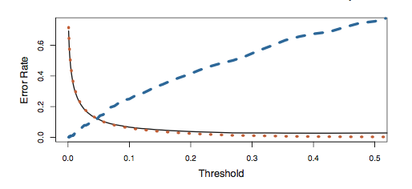

## **a) Problem Setting**: 
**The Client:** An H1B visa applicant
**The Situation:** The client walks in and requests that we to predict their chances of being approved for and H1B visa. The client is able to provide information on their: intended work sector, prevailing wage, whether their position is full time or part time amd the year they applied. 

------------------------------------

## **b) Data Description**: 

```{r, include=FALSE}
#Load libraries
library(mosaic)
library(readr)
library(data.table)
library(MASS)
library(ggplot2)
   
#load data
h1b <- read.csv("/home/local/MAC/mleong/Math-253-Assignments/h1b_kaggle.csv")

#Type transformations
h1b$outcome <- as.numeric(with(h1b,CASE_STATUS=="CERTIFIED"))
h1b$PREVAILING_WAGE <- as.integer(h1b$PREVAILING_WAGE)


## Find a small set of SOC categories
h1b <- h1b %>%
  mutate(soc_biochem = grepl("(chem|bio)", SOC_NAME, ignore.case = TRUE),
         soc_comp = grepl("comp", SOC_NAME, ignore.case = TRUE),
         soc_data = grepl("data", SOC_NAME, ignore.case = TRUE),
         soc_edu = grepl(("educat|teach"), SOC_NAME, ignore.case = TRUE),
         soc_eng = grepl("engin", SOC_NAME, ignore.case = TRUE),
         soc_art = grepl("art", SOC_NAME, ignore.case = TRUE))
  

h1b <- h1b %>%
  mutate(state = gsub(".*, ([A-Z ]{2,})$", "\\1", WORKSITE)) 

```

#### Declaring Test and training data
```{r}
tr = (h1b$X %% 2 == 0)
te = (!tr)

training = h1b[tr, ]
testing = h1b[te, ]
training <- data.table(training)
testing <- data.table(testing)

training<-training[!is.na(PREVAILING_WAGE),]
testing<-testing[!is.na(PREVAILING_WAGE),]

training$outcome <- as.factor(training$outcome)
testing$outcome <- as.factor(testing$outcome)

```

#### Data Visualizations 
```{r}
#1) % of "certified" visas
visual1a<- data.frame(percent=(sum(training$outcome==1)/sum(nrow(training))),H1BStatus="Certified")
visual1b<-data.frame(percent=(sum(training$outcome==0)/sum(nrow(training))),H1BStatus="Rejected")
visual1Total<-rbind(visual1a,visual1b)
                   

ggplot(data=visual1Total,aes(x=H1BStatus,y=(percent*100),fill=H1BStatus))+
  geom_bar(stat="identity",colour="black")+
  ylab("Percent Certified or Rejected (%)")

#2) Mean wage of Approved Applicants Vs. Mean wage of Rejected Applicants
visual2a<- training[outcome==1,.(Wage=mean(PREVAILING_WAGE),H1BStatus="Certified")]
visual2b<- training[outcome==0 & !is.na(PREVAILING_WAGE),.(Wage=mean(PREVAILING_WAGE),H1BStatus="Rejected")]
visual2Total<-rbind(visual2a,visual2b)

ggplot(data=visual2Total,aes(x=H1BStatus,y=Wage,fill=Wage))+
  geom_bar(stat="identity",colour="black")+
  ylab("Mean Prevailing Wage of Applicants by Outcome")

#3) Most Popular Employers
training[,count:=1]
visual3 <- aggregate(training$count,by=list(training$EMPLOYER_NAME),FUN=sum)
colnames(visual3) <- c("EMPLOYER_NAME","ApplicationCount")
visual3 <- visual3[order(visual3$ApplicationCount,decreasing=TRUE),]
visual3 $EMPLOYER_NAME <- factor (visual3 $EMPLOYER_NAME,levels=visual3 $EMPLOYER_NAME)
visual3<-head(visual3,12)

ggplot(visual3, aes(x=EMPLOYER_NAME, y=ApplicationCount)) + 
  geom_point(size=3) + 
  geom_segment(aes(x=EMPLOYER_NAME, 
                   xend=EMPLOYER_NAME, 
                   y=0, 
                   yend=ApplicationCount)) + 
  labs(title="Top Sponsoring Employers of H1-B Visas")+
  theme(axis.text.x = element_text(angle=65, vjust=0.6))
```
------------------------------------

## **c) Classification and regression methods**:  

### c.1 Logistic Regression:
```{r}
names(training)

#outcome~prevailing wage 
modc1Wage <- glm(outcome==1~PREVAILING_WAGE,data=training, family = "binomial")
summary(modc1Wage)

#outcome~ FULL_TIME POSITION
modc1FullTime <- glm(outcome==1~FULL_TIME_POSITION,data=training, family = "binomial")
summary(modc1FullTime)

#outcome~ Big h1b employer
training[,applicationCount:=sum(count),by=.(EMPLOYER_NAME)]
bigEmployerThres<-mean(training$applicationCount)*2 
#Note: I defined big employer as an employer who has twice the mean of total applications
training[applicationCount>bigEmployerThres,bigEmployer:=1]
training[is.na(bigEmployer),bigEmployer:=0]
modc1BigEmployer <- glm(outcome==1~bigEmployer,data=training,family="binomial")
summary(modc1BigEmployer)

#outcome~Wage*FullTime*Big Employer
modc1Interaction <- glm(outcome==1~PREVAILING_WAGE*FULL_TIME_POSITION*bigEmployer,data=training,family="binomial")


```


### c.2 Linear Disciminate Analysis (LDA) / Quadratic Discriminate Analysis (QDA):

```{r}
lda1 = lda(outcome ~ FULL_TIME_POSITION, data = training)
lda1 

lda1Pred = predict(lda1, testing)
ldaPredictionClass = lda1Pred$class

h1bOutcome = testing$outcome
table(ldaPredictionClass, h1bOutcome)


#Testing Error
mean(ldaPredictionClass != h1bOutcome)

```


```{r}
library(grid)
qda1 = qda(outcome ~ FULL_TIME_POSITION, data = training)
qda1 

qda1Pred = predict(qda1, testing)
qdaPredictionClass = qda1Pred$class

h1bOutcome = testing$outcome
table(qdaPredictionClass, h1bOutcome)


#Testing Error
mean(qdaPredictionClass != h1bOutcome)


```
# Change posterior threshold! 

    


# p > 1 
```{r}

lda2 = lda(outcome ~ PREVAILING_WAGE + FULL_TIME_POSITION + soc_data, data = training)

lda2


lda2Pred = predict(lda2, testing)
lda2Class = lda2Pred$class

table(lda2Class, h1bOutcome)

#ldaClass = na.omit(ldaClass)
#mean(ldaClass != testing$outcome)

#Testing Error
table(lda2Class == h1bOutcome) / nrow(testing)

```

## Sensitivity & Specificity: 

### Sensitivity: percentage of true approvals that are identified (so 1 & 1)  = (720295)/720296 = 99.9% 
### Specificity: percentage of non-approvals that are correcrtly identified = 255/(255+101672) = 0.25%

### There is a VERY high chance that our model will tell you that you'll be approved but in reality, you'll be rejected! :( 

### this is more dangerous than telling you that you're rejected but you get approved

------------------------------------  

## **d) Evaluation of results:**  


------------------------------------
## **d) Recommendations:**   

